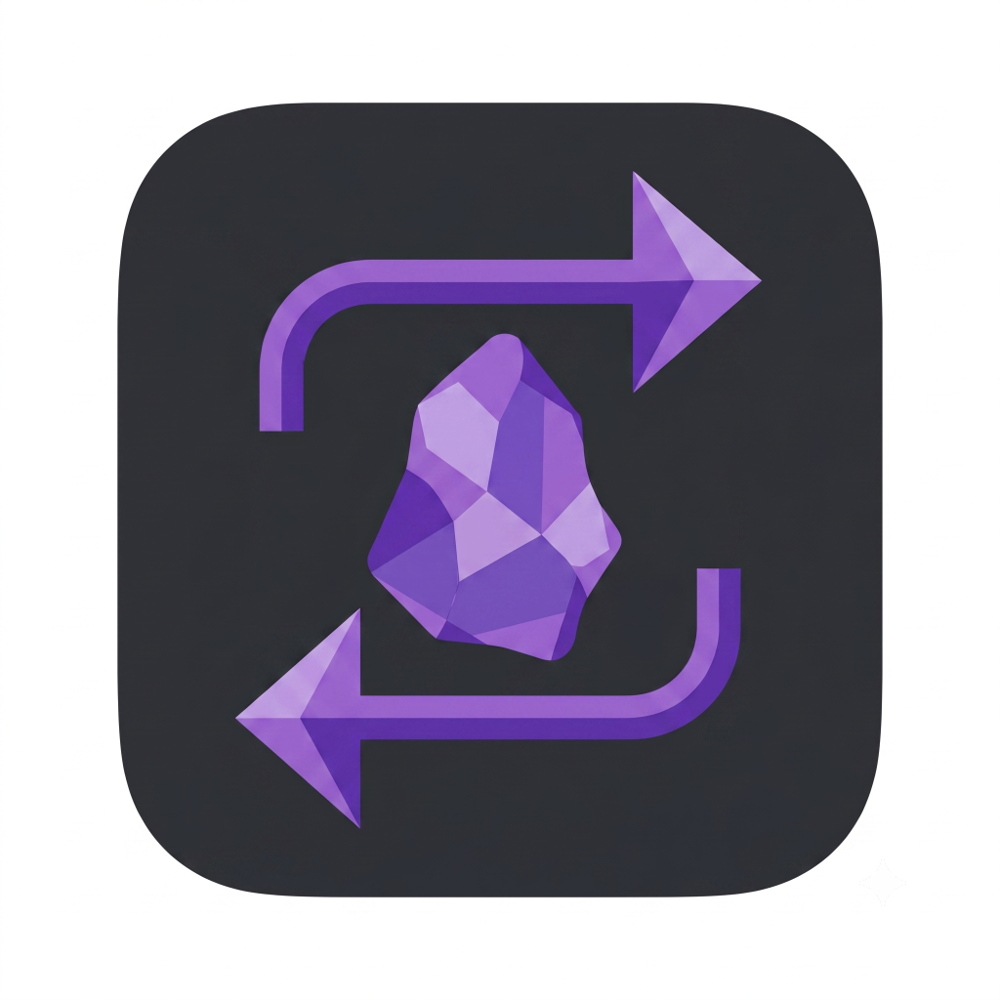

#  Obsidian API Sync

> A Remote Vault Sync Ecosystem for Obsidian & AI Agents

**Obsidian API Sync** is a headless CMS / sync layer that acts as a Single Source of Truth for markdown files. A human edits notes in Obsidian; an AI agent reads and writes via REST. Both see changes in real time over WebSockets.

```
┌─────────────┐   WebSocket (live sync)   ┌─────────────────────┐
│   Obsidian  │ ◄────────────────────────► │   FastAPI Server    │
│   Plugin    │                            │   (Obsidian API Sync-api)      │
└─────────────┘                            │                     │
                                           │  SQLite  │  Vault   │
┌─────────────┐   REST /api/files          │  tokens  │  .md     │
│  AI Agent   │ ◄────────────────────────► │  audit   │  files   │
│  (Obsidian API Sync)   │   OpenAPI / MCP schema     └─────────────────────┘
└─────────────┘
```

## Features

- **REST API** — `GET / POST / DELETE /api/files/{path}` with Bearer token auth
- **WebSocket sync** — `/ws/sync` broadcasts `FILE_CHANGED` to all connected clients instantly
- **OpenAPI schema** — `/openapi.json` with AI-agent-readable descriptions, ready to ingest as an MCP tool
- **Web Dashboard** — dark-mode Tailwind UI for vault path, token management, config export, and live audit log
- **Obsidian Plugin** — TypeScript plugin with WS state machine, 800ms debounced sends, exponential backoff reconnect, echo-loop prevention, and Quick Import config
- **No vault path restart** — change the vault directory from the Dashboard; it takes effect instantly (stored in SQLite, never cached)

## Project Structure

```
obsidian-api-sync/
├── server/                    # FastAPI backend
│   ├── config.py              # Pydantic settings
│   ├── database.py            # aiosqlite async layer
│   ├── auth.py                # Bearer token dependency
│   ├── main.py                # App + dashboard routes
│   ├── routers/
│   │   ├── files.py           # REST CRUD endpoints
│   │   └── ws.py              # WebSocket ConnectionManager
│   ├── templates/
│   │   └── dashboard.html     # Jinja2 + Tailwind CDN UI
│   ├── requirements.txt
│   └── .env.example
│
└── obsidian-plugin/           # Obsidian community plugin
    ├── src/
    │   ├── types.ts            # Shared payload interfaces
    │   ├── ws-client.ts        # WebSocket FSM + debounce
    │   ├── settings.ts         # Settings tab + Quick Import
    │   └── main.ts             # Plugin lifecycle
    ├── manifest.json
    ├── package.json
    └── esbuild.config.mjs
```

## Quick Start

### 1. Server (Local/Windows)

```bash
cd server

# Install dependencies (uses uv — fast Python package manager)
pip install uv  # or: irm https://astral.sh/uv/install.ps1 | iex
uv venv .venv --python 3.12
uv pip install -r requirements.txt

# Configure
cp .env.example .env
# Edit .env: set SECRET_KEY and ADMIN_PASSWORD

# Run
.venv/Scripts/activate   # Windows: .\.venv\Scripts\Activate.ps1
uvicorn main:app --host 0.0.0.0 --port 8000 --reload
```

Open `http://localhost:8000/dashboard` → log in → generate a token → copy the **Connect** config.

### 1b. Server (Linux VM Deployment)

If deploying to a Linux VM (e.g. Ubuntu on Azure/AWS/DigitalOcean):

```bash
# 1. Clone and install dependencies
git clone https://github.com/YourUsername/obsidian-api-sync.git
cd obsidian-api-sync/server
curl -LsSf https://astral.sh/uv/install.sh | sh
source $HOME/.local/bin/env
uv venv .venv --python 3.12
uv pip install -r requirements.txt

# 2. Configure environment
cp .env.example .env
nano .env # Set SECRET_KEY, ADMIN_PASSWORD, and absolute DEFAULT_VAULT_PATH

# 3. Create a systemd service
sudo nano /etc/systemd/system/ob-api.service
```

Paste this into the service file (adjust paths for your username):
```ini
[Unit]
Description=Obsidian API Sync API
After=network.target

[Service]
User=yourusername
WorkingDirectory=/home/yourusername/obsidian-api-sync/server
ExecStart=/home/yourusername/obsidian-api-sync/server/.venv/bin/uvicorn main:app --host 0.0.0.0 --port 8000
Restart=always
RestartSec=5
EnvironmentFile=/home/yourusername/obsidian-api-sync/server/.env

[Install]
WantedBy=multi-user.target
```

Enable and start the service:
```bash
sudo systemctl daemon-reload
sudo systemctl enable ob-api
sudo systemctl start ob-api
```
Your dashboard will be available at `http://<your-vm-ip>:8000/dashboard`.


### 2. Obsidian Plugin

```bash
cd obsidian-plugin
npm install
npm run build   # produces main.js
```

Copy `main.js` + `manifest.json` into:
```
<your-vault>/.obsidian/plugins/obsidian-api-sync/
```

Enable in **Obsidian → Settings → Community Plugins → Obsidian API Sync**.

Paste the Base64 config string from the Dashboard into **Quick Import** → click Import → Connect.

## API Reference

All `/api/` endpoints require `Authorization: Bearer <token>`.

| Method | Route | Description |
|--------|-------|-------------|
| `GET` | `/api/files` | List all `.md` files in vault |
| `GET` | `/api/files/{path}` | Read file content |
| `POST` | `/api/files/{path}` | Create or overwrite file (`text/plain` body) |
| `DELETE` | `/api/files/{path}` | Delete file |
| `WS` | `/ws/sync?token=<t>` | Real-time bidirectional sync |
| `GET` | `/openapi.json` | OpenAPI schema (MCP-ready) |
| `GET` | `/dashboard` | Web control panel |

## AI Agent Integration

Point your AI agent (Hermes, Claude, GPT, etc.) at `/openapi.json`. Every endpoint carries verbose, action-oriented descriptions designed to be parsed as MCP tool definitions — no additional annotation needed.

```json
{
  "server": "http://your-server:8000",
  "token": "your-bearer-token"
}
```

### 🤖 Prompt for your Agent

If you want an AI agent to set this project up for you automatically on your machine, copy and paste this exact prompt to them:

> **You are setting up the Obsidian API Sync server.**
> 1. The project has a `run.bat` (for Windows) and a `run.sh` (for Linux/macOS) in the root directory. These scripts automatically activate the virtual environment and start the FastAPI server.
> 2. You should inspect the system to determine which script is appropriate.
> 3. **Ask me** if I want to configure the service to run on boot.
> 4. If I say yes, use the appropriate script (`run.bat` or `run.sh`) to set up a Windows Scheduled Task (running at Logon) or a Linux `systemd` service so that the API server starts automatically in the background whenever I start my machine.

## WebSocket Protocol

Connect: `ws://host:8000/ws/sync?token=<your-token>`

**Send** (client → server):
```json
{ "type": "FILE_MODIFY", "path": "folder/note.md", "content": "# Hello" }
```

**Receive** (server → all clients):
```json
{ "type": "FILE_CHANGED", "path": "folder/note.md", "content": "# Hello", "source": "ws", "ts": "..." }
```

Close code `4001` = auth failure (do not reconnect).

## License

MIT
